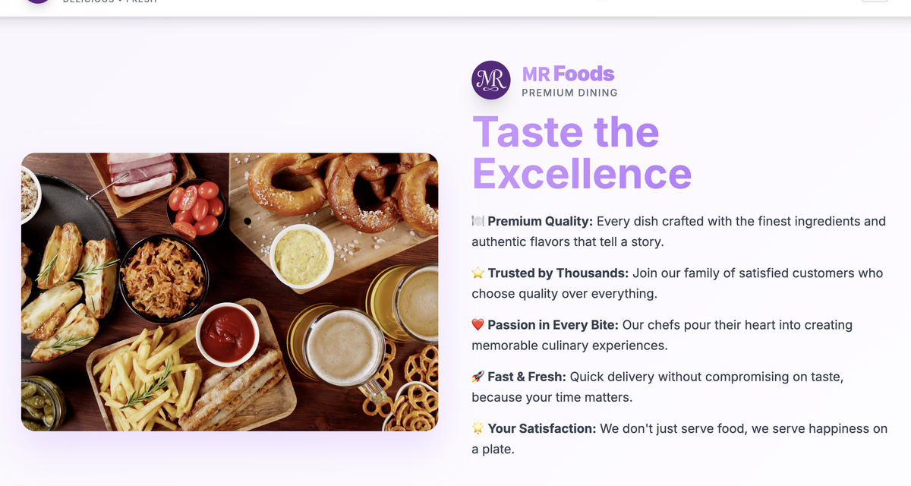

# MR Foods Website



A modern, full-featured food ordering web application built with **Next.js 15**, **React 19**, and **Tailwind CSS**. MR Foods offers a premium dining experience online, allowing users to browse a diverse menu, add items to their cart, and place orders with ease.

## Features

- 🍽️ **Browse Menu:** Explore Indian, Fast Food, Chinese, Rajasthani, and Cold Drinks categories with images and prices.
- 🛒 **Cart & Checkout:** Add items to your cart, view order summary, and place orders securely.
- 👤 **User Authentication:** Login modal and user context for personalized experience.
- 📦 **Order History:** View your past orders and statuses.
- 📱 **Responsive Design:** Mobile-first, beautiful UI with Tailwind CSS.
- ⚡ **Fast & Fresh:** Optimized for quick navigation and order placement.
- 🎨 **Modern UI:** Custom components, gradients, and interactive elements.

## Tech Stack

- **Framework:** [Next.js 15](https://nextjs.org/)
- **Language:** TypeScript, React 19
- **Styling:** Tailwind CSS, custom gradients, and animations
- **State Management:** React Context (Cart, User, Orders)
- **UI Components:** Radix UI, Lucide Icons, custom UI kit
- **Other:** PostCSS, Vercel deployment

## Getting Started

### Prerequisites

- Node.js 18+
- pnpm (recommended) or npm/yarn

### Installation

```bash
pnpm install
# or
npm install
```

### Development

```bash
pnpm dev
# or
npm run dev
```

### Production Build

```bash
pnpm build && pnpm start
# or
npm run build && npm start
```

## Project Structure

- `app/` — Next.js app directory (pages, layouts, API routes)
- `components/` — UI and context components (cart, user, orders, header, footer, etc.)
- `lib/foodData.ts` — Food and drinks data
- `public/images/` — Food, drinks, and branding images
- `hooks/` — Custom React hooks
- `tailwind.config.ts` — Tailwind CSS configuration

## Scripts

- `dev` — Start development server
- `build` — Build for production
- `start` — Start production server
- `lint` — Lint code

## License

This project is for educational/demo purposes. All images and content © MR Foods.

---

> **MR Foods** — Taste the Excellence. Delivered with Love.
